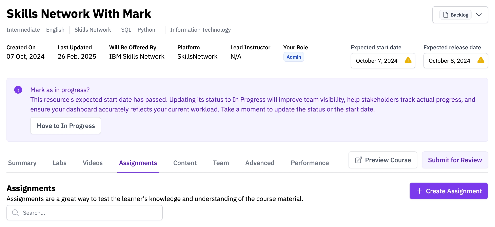
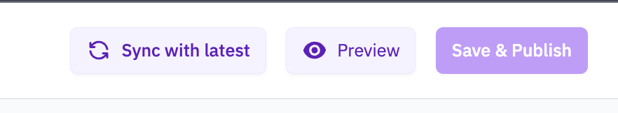
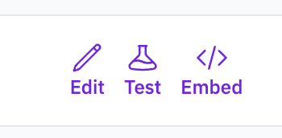
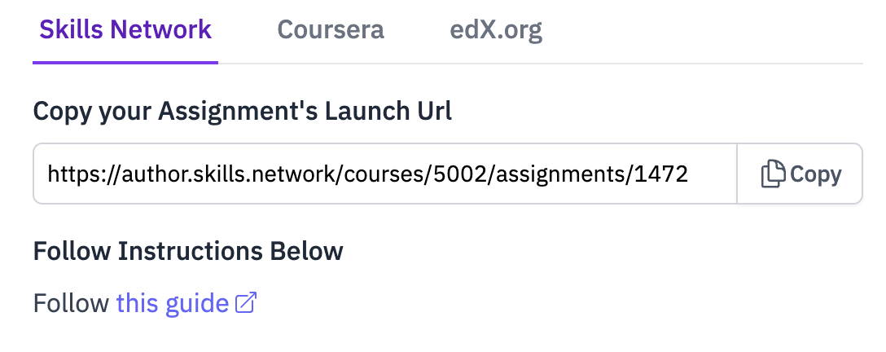
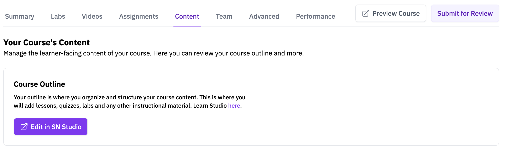

# Mark — Quick-Start Guide for Skills Network

Mark is an **AI-powered assessment platform** that lets authors build, publish, and grade assignments while giving learners instant feedback. It's our preferred tool for creating and delivering assessments.

---

## 1 Creating an Assignment

1. **Create a course** (or open an existing one).
2. Go to **Assignments ▸ Create Assignment**.

   

3. Enter an **assignment name** when prompted.
4. The authoring editor opens—add questions and click **Publish** when you're ready.

---

## 2 Testing a Published Assignment

You have two testing options:

| Mode        | Where you find it          | Purpose                   |
| ----------- | -------------------------- | ------------------------- |
| **Preview** | Inside Mark's authoring UI | Quick check while editing |
| **Test**    | Course player              | Full learner flow         |

### 2.1 Test Button

### 2.2 Preview Button

---

## 3 Adding Mark to Skills Network

### 3.1 Copy the LTI Launch URL

In **AWB ▸ Assignments**, click the **Embed** icon.

Copy the **Launch URL** from the modal:

### 3.2 Configure LTI in Skills Network

1. Open **Content** in your course and click **Edit in SN Studio**.  
   

2. In Studio, create **New Subsection ▸ New Unit**.  
   
   

3. Click **Advanced** (flask icon) → **LTI Consumer**.  
     
   

4. Press **Edit** and fill in the fields:

   | Field                       | Value                             |
   | --------------------------- | --------------------------------- |
   | **LTI ID**                  | `sn_lti`                          |
   | **LTI URL**                 | _Launch URL_ (from step&nbsp;3.1) |
   | **Launch Target**           | `New Window`                      |
   | **Request user's username** | `true`                            |
   | **Request user's email**    | `true`                            |
   | **Send extra parameters**   | `true`                            |

5. **Save** ➜ **Preview** the unit. Use "View this course as…" to test both **Author** and **Learner** views.

---

## 4 Need Help?

If you have any problem with Mark, please talk to the Mark chat bot. Mark chatbot is smart and it will help you with problems. If it struggles with helping you, it will forward us a support ticket so do not worry!
