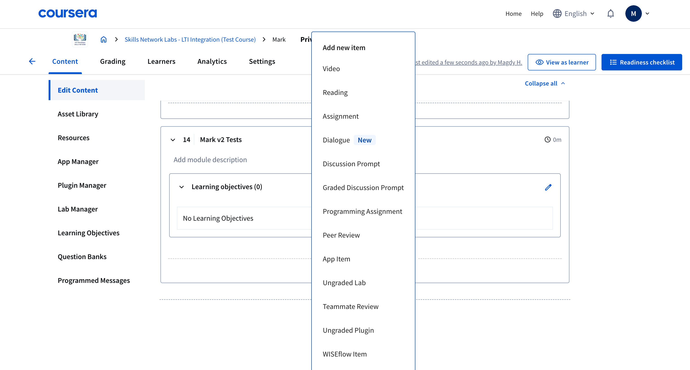
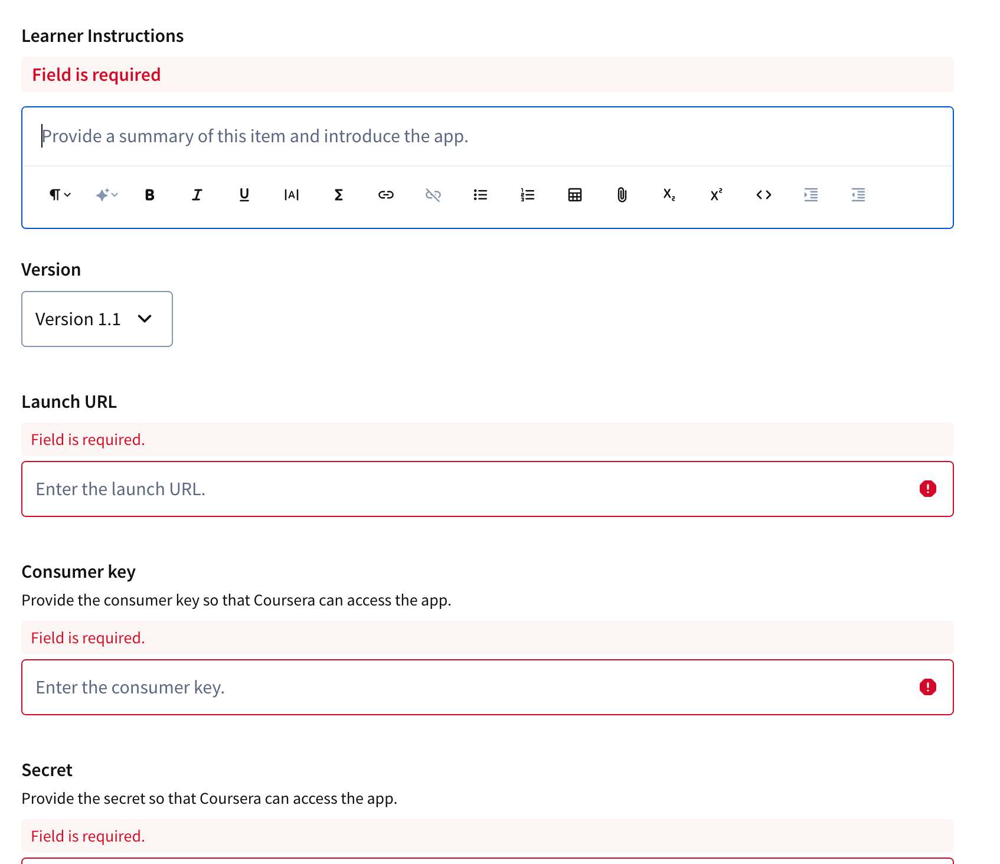

# Coursera

This guide shows the Coursera-specific steps for embedding Mark assignments. First, get your LTI Launch URL using the **Embedding Mark - General Instructions**.

---

## Configure LTI in Coursera

1. In **Content**, choose **Edit Content**, create a **Module**, then **Add Item ▸ App Item**.  
   

2. Launch the item and click **Switch to classic experience**.  
     
   

3. Complete the form:

   - **Learner Instructions** – brief description
   - **Launch URL** – from general instructions
   - **Consumer Key** / **Shared Secret** – from the embed modal
   - _(Optional)_ **Callback** – enable to sync grades back to Coursera
   - **Privacy** – enable **Share learner ID, full name, and email address**

   

4. Click **Publish**, then **View as Learner** to test.
