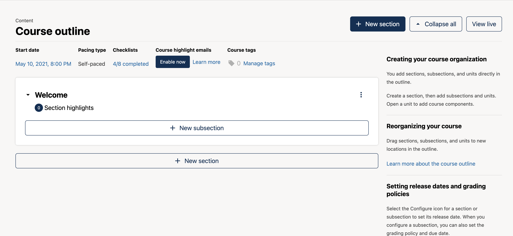
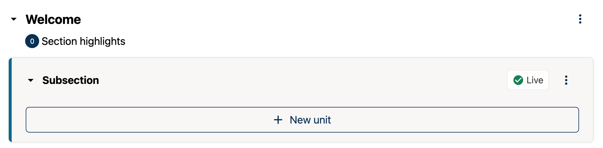
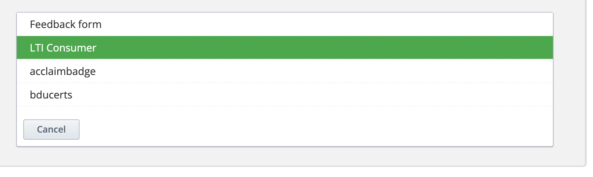

# edX.org

This guide shows the edX.org-specific steps for embedding Mark assignments. First, get your LTI Launch URL using the **Embedding Mark - General Instructions**.

---

## Configure LTI in edX.org Studio

1. Open **Content** in your course and access the Studio editor.

2. Create **New Subsection ▸ New Unit**.  
   
   

3. Click **Advanced** (flask icon) → **LTI Consumer**.  
     
   

4. Press **Edit** and fill in the fields:

   | Field                       | Value                                     |
   | --------------------------- | ----------------------------------------- |
   | **LTI ID**                  | `sn_lti`                                  |
   | **LTI URL**                 | *\[Launch URL from general instructions]* |
   | **Launch Target**           | `New Window`                              |
   | **Request user's username** | `true`                                    |
   | **Request user's email**    | `true`                                    |
   | **Send extra parameters**   | `true`                                    |
   | **Scored** \*               | `true`                                    |

   > **Note:** Ensure **Scored** is set to `true` for **graded assignments**, so that grades can be assigned to the learner upon completion.

5. **Save** ➜ **Preview** the unit. Use "View this course as…" to test both **Author** and **Learner** views.
